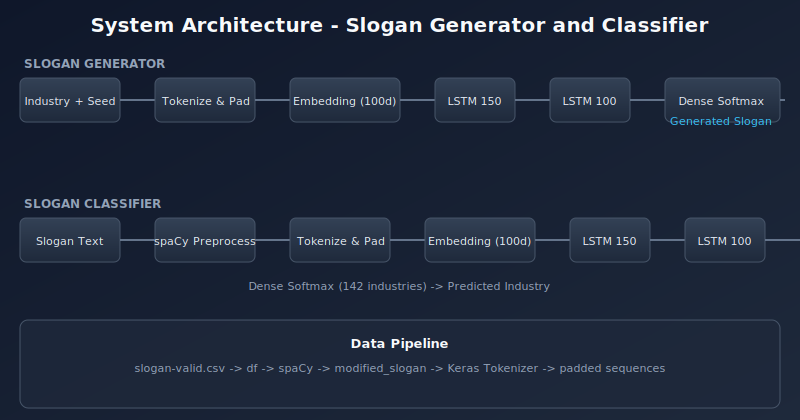

# Project: Slogan Classifier and Generator

**Repository:** `slogan-classifier-generator`  
**Description:** LSTM-based slogan generator and industry classifier — TensorFlow, spaCy, Keras. Capstone project.

A deep learning project that trains two LSTM-based models: one that **generates** business slogans from an industry label, and one that **classifies** a slogan into an industry. Built with TensorFlow/Keras, spaCy, and scikit-learn.

---

## Table of Contents

- [Overview](#overview)
- [Architecture](#architecture)
- [Features](#features)
- [Requirements](#requirements)
- [Installation](#installation)
- [Usage](#usage)
- [Project Structure](#project-structure)
- [Model Details](#model-details)
- [Dataset](#dataset)
- [Results](#results)
- [Troubleshooting](#troubleshooting)

---

## Overview

This project implements:

| Component | Description |
|-----------|-------------|
| **Slogan Generator** | Given an industry (e.g. `"internet"`), produces a short slogan by predicting the next token at each step using a trained LSTM. |
| **Slogan Classifier** | Given a slogan string, predicts which of 142 industries it belongs to using a separate LSTM classifier. |

Both models share the same vocabulary and embedding setup; the generator is trained on sequences of `industry + processed_slogan`, and the classifier on preprocessed slogans with industry labels.

---

## Architecture



**Slogan Generator:** Industry + seed → tokenize & pad → Embedding (100d) → LSTM (150) → LSTM (100) → Dense (softmax) → generated slogan.

**Slogan Classifier:** Slogan text → spaCy preprocess → tokenize & pad → Embedding (100d) → LSTM (150) → LSTM (100) → Dense softmax (142 classes) → predicted industry.

---

## Features

- **Text preprocessing** with spaCy: tokenization, lowercasing, punctuation removal.
- **Sequence generation** via LSTM with industry-prefixed training sequences.
- **Multi-class classification** over 142 industry categories.
- **Unified tokenizer** and embedding space for both models.

---

## Requirements

| Requirement | Version / note |
|-------------|-----------------|
| **Python** | 3.11 recommended (TensorFlow compatibility) |
| **TensorFlow** | 2.16.x |
| **Keras** | 3.13.x |
| **spaCy** | 3.8.x + `en_core_web_sm` |
| **Other** | pandas, numpy, scikit-learn |

---

## Installation

### 1. Create a virtual environment

```bash
python3.11 -m venv venv
source venv/bin/activate   # macOS / Linux
# venv\Scripts\activate    # Windows
```

### 2. Install dependencies

```bash
pip install -r requirements.txt
python -m spacy download en_core_web_sm
```

---

## Usage

### Run the notebook

1. Activate the environment and start Jupyter:

   ```bash
   source venv/bin/activate
   jupyter notebook neural_network_task.ipynb
   ```

2. Place `slogan-valid.csv` in the project root (or adjust the path in the notebook).

### Example: generate and classify

```python
# Generate a slogan for an industry
generated_slogan = generate_slogan("internet")
print(generated_slogan)

# Classify a slogan
predicted_industry = classify_slogan("innovative cloud solutions for businesses")
print(predicted_industry)

# Full pipeline: generate then classify
industry = "internet"
generated_slogan = generate_slogan(industry)
predicted_industry = classify_slogan(generated_slogan)
print(f"Generated: {generated_slogan}")
print(f"Predicted industry: {predicted_industry}")
```

---

## Project Structure

```
.
├── neural_network_task.ipynb   # Main notebook (training + inference)
├── slogan-valid.csv             # Slogan dataset (required)
├── requirements.txt             # Python dependencies
├── README.md                    # This file
├── docs/
│   └── architecture.svg        # Architecture diagram
└── venv/                        # Virtual environment (optional, git-ignored)
```

---

## Model Details

### Slogan Generator (`gen_model`)

| Layer | Configuration |
|-------|----------------|
| Embedding | `input_dim=total_words`, `output_dim=100`, `input_length=max_seq_len-1` |
| LSTM 1 | 150 units, `return_sequences=True` |
| LSTM 2 | 100 units |
| Dense | `total_words` units, softmax |

- **Loss:** categorical cross-entropy  
- **Optimizer:** Adam (default lr)  
- **Training:** 50 epochs  

### Slogan Classifier (`class_model`)

| Layer | Configuration |
|-------|----------------|
| Embedding | `input_dim=total_words`, `output_dim=100`, `input_length=max_seq_len` |
| LSTM 1 | 150 units, `return_sequences=True` |
| LSTM 2 | 100 units |
| Dense | 142 units (industries), softmax |

- **Loss:** categorical cross-entropy  
- **Optimizer:** Adam (default lr)  
- **Training:** 50 epochs, with validation split  

---

## Dataset

- **File:** `slogan-valid.csv`
- **Rows:** 5,346
- **Industries:** 142 unique categories
- **Relevant columns:** `output` (slogan text), `industry` (label)

---

## Results

| Model | Metric | Note |
|-------|--------|-----|
| Generator | ~66% training accuracy | Learns industry-conditioned word sequences. |
| Classifier | ~17% test accuracy | 142 classes; performance limited by class count and imbalance. |

The classifier is trained and evaluated on real slogans; when fed **generated** slogans, agreement with the generator’s industry may be lower due to distribution shift.

---

## Troubleshooting

| Issue | Solution |
|-------|----------|
| `tensorflow.keras.optimizers` import error | Use `from keras.optimizers import Adam` (Keras 3). |
| spaCy model not found | Run `python -m spacy download en_core_web_sm`. |
| Dataset not found | Ensure `slogan-valid.csv` is in the project root or update the path in the notebook. |

---

*Project — Neural Networks*

*Created by Senzo Nelson Ncekana for learning and portfolio purposes.*
# Slogan-Classifier-and-Generator
